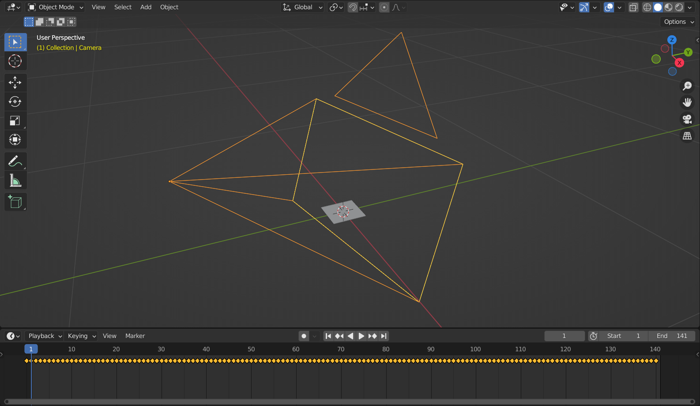
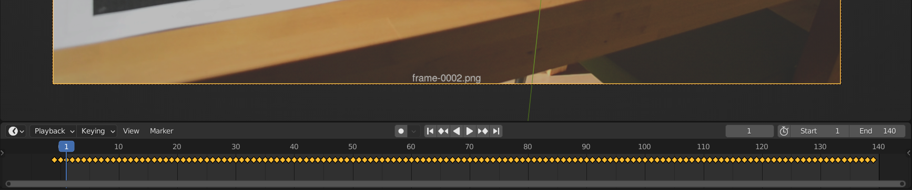
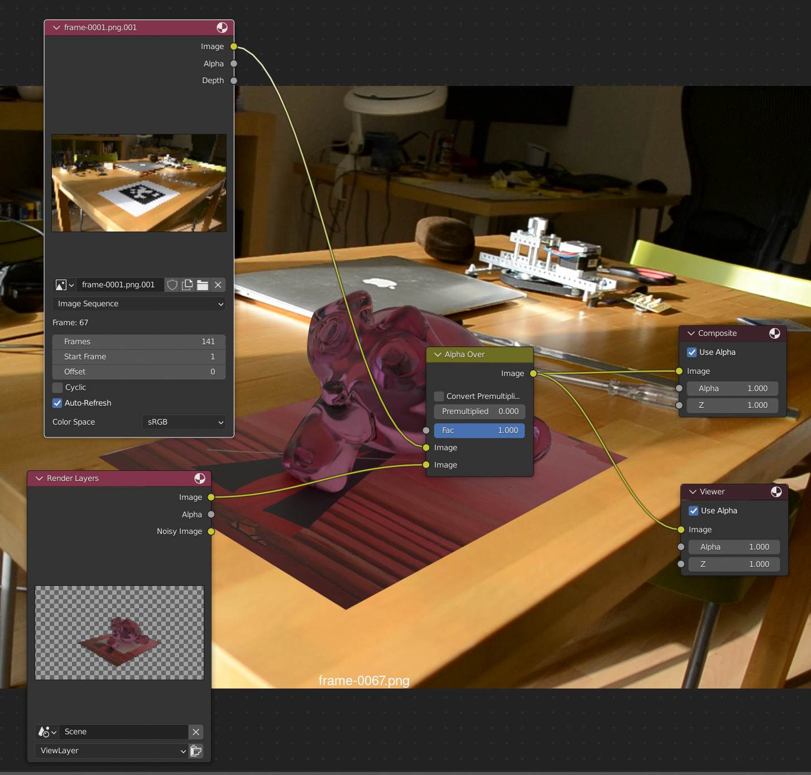
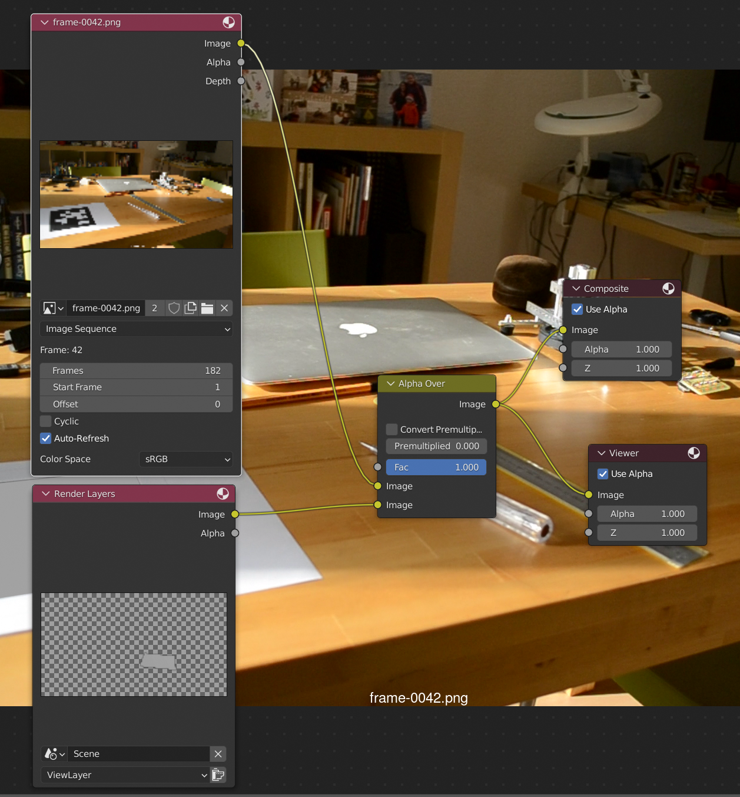
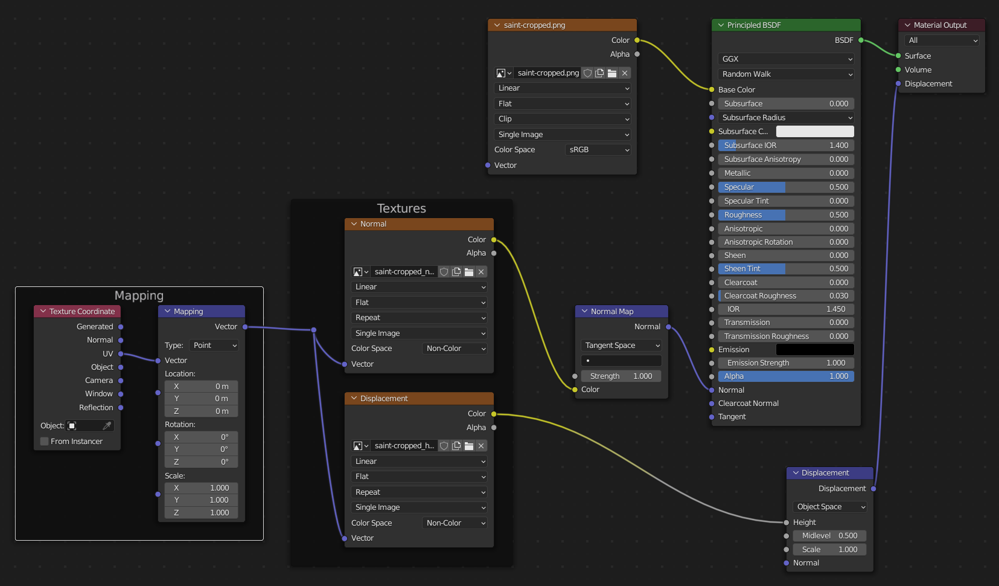
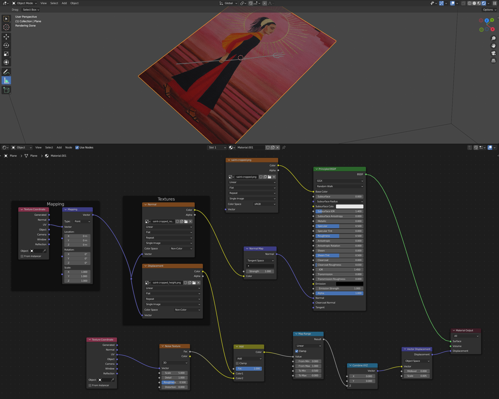

AprilTools
==========

See Default Cube's video ["Tracking with April Tools In-Depth"](https://youtu.be/g4s4fFmh8DQ).

---

The first issue was the tag - I had the issue described [here](https://github.com/AprilRobotics/apriltag-imgs/issues/4#issuecomment-850044277) that Preview on Mac and Chrome on Linux smoothed the tags.

So, I used one of the tags generated by @rgov instead:

* For [A4](https://github.com/rgov/apriltag-pdfs/blob/main/tag36h11/a4/200mm/tag36h11_200mm_id000.pdf).
* For [US Letter](https://github.com/rgov/apriltag-pdfs/blob/main/tag36h11/us_letter/200mm/tag36h11_200mm_id000.pdf).

---

For getting Docker set up, see [here](https://github.com/george-hawkins/docker-cplusplus-coroutines#setup).

---

There's almost nothing to AprilTools (see [`build-apriltools`](build-apriltools)) and the real work is being done by AprilTag (see [`build-apriltag`](build-apriltag)) and OpenCV.

---

To build the Docker image:

    $ docker-compose build

Then set up UID and GID (so that the `docker-compose.yml` file can pick them up to set the correct ownership on output files):

    $ export GID=$(id --group)
    $ export UID

Then to run AprilTools:

    $ docker-compose run hirsute-apriltools apriltools --help
    Usage: apriltools [options] <input files>
      -h | --help                   [ true ]       Show this help   
      -p | --path                   [  ]           Path to the source image sequence   
      -f | --focal-length-mm        [ -1 ]         Focal length in mm   
      -F | --focal-length-pixels    [ -1 ]         Focal length in pixels   
      -w | --sensor-width           [ -1 ]         Camera sensor width in mm   
      -s | --tag-size               [ -1 ]         Tag size (black border, side of the square) in mm   
      -e | --estimate-focal-length  [ false ]      Do not track the marker; instead, estimate the camera focal length in pixels from the provided footage.   
      -q | --quick                  [ false ]      Speed up the process at the expense of reduced accuracy. 

---

Convert footage to frames:

    $ ffmpeg -i my-movie.mov frames/frame-%04d.png

And work out which ones you want to use.

For long clips, extracting all frames becomes a pain. Surprisingly, you can't use `ffmpeg` to easily extract a sequence starting at a specific frame (see [here](https://github.com/george-hawkins/movie-tracking/blob/master/movie-editing.md) and search for "you can't just clip from a given start frame number").

So you can use my [frame-extractor tool](https://github.com/george-hawkins/frame-extractor) or go _New / Video Editing_ in Blender, add in the relevant clip and then render out the desired range.

---

If your frames aren't numbered from 1 things can get a little confusing in Blender. E.g. I just used the frames numbered 1478 to 1596 in my experiment. You can renumber things like so:

So renumber things:

    $ mv frames frames-orig
    $ mkdir frames
    $ cd frames-orig
    $ count=1
    $ for frame in frame-*.png
    do
        mv $frame ../frames/frame-$(printf "%04d" $count).png
        let count++
    done

Or just make sure to set the _Start_ and _End_ frame appropriately after you've imported things with the AprilTools plugin (see below).

---

Estimate the focal length:

    $ docker-compose run hirsute-apriltools apriltools --path frames --estimate-focal-length

It didn't seem to do a very good job on my footage, it just output:

    Focal length estimation complete. Best guess: -1.00 px.

Which was nothing like the real values, so I used the value I knew were correct.

TODO: I shot a clip where I moved around a tag, I noticed that it failed to guess a focal-length when looking from the bottom of the tag rather than the side. So, I think there's a bug here where e.g. you maybe have to check some y-related value if you fail to find an estimate tied to some x-related value (just guessing wildly).

---

Measure the size of your tag, mine was 144mm on each side.

---

Get it to produce the camera track:

    $ docker-compose run hirsute-apriltools apriltools --focal-length-mm=18 --sensor-width=23.1 --tag-size 144 --path frames
    searching for files...
    Found 119 valid files in the specified directory.
    Processed 1/119 files, out of which 0 blurry (?) and 0 were unusable (no tag found).
    ...
    Processed 119/119 files, out of which 0 blurry (?) and 0 were unusable (no tag found).

    Focal length: 18.00 mm (1496.10 px); sensor width: 23.10 mm
    Camera track saved to: frames/track.txt
    Open Blender and go to file-> import -> Apriltools tracking data (install the plugin if you haven't already) to import the tracking data.

It writes it to `frames/track.txt`.

---

If you look at the `track.txt` file, you'll see:

```
$ head frames/track.txt 
frames/frame-1478.png
18.0000, 23.1000, 144.0000, 0, 0,0,0
1478, 1.6287,0.0313,-0.1006,1.1443,-0.4892,3.2717
```

It turns out that the `apriltags_import.py` importer can only work with absolute paths.

And as the path within the Docker container would be different to the local path, this is unfortunately something you have to resolve by hand.

Just edit the file and add in the full path on the first line, so you end up with:

```
$ head frames/track.txt 
/home/joebloggs/my-april-tools-project/frames/frame-1478.png
18.0000, 23.1000, 144.0000, 0, 0,0,0
1478, 1.6287,0.0313,-0.1006,1.1443,-0.4892,3.2717
```

---

In Blender, select _New / General_ and now we'll install the add-on - first retrieve it:

    $ curl -O https://raw.githubusercontent.com/thegoodhen/AprilTools/master/bin/apriltags_import.py

In Blender, go to _Edit / Preference / Add-ons_, click _Install_, find and select the `apriltags_import.py` file and click _Install Add-on_.

After an oddly long pause, it should show up in the list of add-ons. So tick it to enable it.

---

Delete the default cube. Go to _File / Import / Apriltools tracking data_ and import your `track.txt` file.

Things look a little unusual at first, the small plane, that you see at the origin, actually corresponds to your tag.



Off-by-one issue
----------------

Note: the following is about the version of AprilTools as it existed on 5th April, 2022 (when the last commit was `4733665` from 3rd August, 2020).

There's an off-by-one issue in how AprilTools sets the _Start_ and _End_ frame - as you can see above it's set _Start_ to 1 and _End_ to 141. But if you go into camera view - `Numpad-0` and scrub to frame 0, you'll see there's a frame there and if you scrub to frame 141 you'll see there's no frame there.

If you don't fix this now, it'll cause you no end of pain later. You can do one of two things:

* Simply adjust the _Start_ value from 1 to 0 and similarly reduce the _End_ value by 1.
* Or go to the _Object Data_ properties for the camera, expand the _Background Images_ section and change the _Start_ value from 0 to 1, then go to the _Timeline_, press `a` to select all the keyframes and drag them forward 1 frame.

The second option sounds more complicated but life is just easier in Blender if your timeline starts at 0 rather than 1.

---

The above assumes you're numbering your frames from 1. Things get even more confusing if you insist on numbering them from 0. If you import a sequence e.g. starting `frame-0000.png` then you'll end up with:



Now, you've ended up with a frame and keyframe at -1 (that you can't scrub to() and (with the playhead showing frame 1) the frame shown is `0002.png` (with `0001.png` and `0000.png` being behind the playhead). Here you can't solve things by setting _Start_ and _End_ (as you cannot set _Start_ to a value below 0). So as above, set the _Start_ value for the camera's _Background Images_ to 1 (yes, really, 1 just as before) and drag the keyframes forward 1 frame. But additionally, you have to increase the _Frames_ count for the _Background Images_ by 1 and set the _Start_ value for the timeline to 0.

Or alternatively you can do these sames steps (including increasing the _Frames_ count) but instead of setting the _Start_ value to 0, set the _Offset_ value for _Background Images_ to -1.

This works but on the whole avoid numbering frames from 0 rather than 1 - the default assumption in Blender is that the first frame is numbered 1.

---

If you import a sequence e.g. going from `0042.png` to `0182.png` then just fix things up as described for the `0001` case, i.e. adjust the _Start_ value for the _Background Images_ to 1 and drag the keyframes forward 1 frame. And additionally set the timeline _Start_ value to the number of your first frame, i.e. 42 in this case.

---

If you just go _New / General_ and add an image sequence, e.g. starting with `0001.png`, as a background to the camera then it will always set the _Start_ value seen there to 1. So I think AprilTools is just wrong to set this to 0. And if you use a sequence starting e.g. with `0000.png` then it will still set the _Start_ values to 1 but also set the _Offset_ value to -1 (rather than leaving it as 0). So when the playhead is at 1, you'll see the frame `0000.png`.

Note: if you import a sequence starting at `0000.png` and you drag the playhead back to 0, you'll actually see the same image, i.e. `0000.png` for both frame 0 and 1. I've also seen the same effect beyond the end of the sequence in other circumstances. I think this is just a a bug around looking at frames outside the actual bounds of actual frames.

Again - just stay clear of numbering from 0.

Note: when setting up _Background Images_ for the camera, you can choose the source to be _Image_ or _Movie Clip_. Both actually accept image sequences. AprilTools sets things up as if source _Image_ had been selected. If you were doing conventional Blender _Motion Tracking_ and clicked _Set as Background_ there then it would set things up as if source _Movie Clip_ had been selected - here you don't have a settable _Start_ or _Offset_ but you get to control of different things.

Back to the fun part
--------------------

Once, you imported things and fixed things up, you can then go to the camera view and press play, you'll see the plane covering the marker as the frames play.

Note: initially, nothing worked because `track.txt` didn't contain an absolute path (see above) and the frames were numbered from 1478 (and I hadn't set _Start_ and corrected the other things as described).

The only other thing I had to do was go to _Render_ properties, expand _Color Management_ and set _View Transform_ to _Standard_.

Note: when importing `track.txt`, you can chose to specify that it's the tag that's moving and not the camera.

---

The tag looks a little tiny in Blender - but it's tiny in real life - it's got the correct dimensions, i.e. 144x144mm in my case.

---

If you want to be able to scale and move things such that the camera and tag maintain the correct relationship:

* Make sure nothing is selected.
* Then `shift-A` and select _Empty / Plain Axes_.
* Unselect it, then shift-click the plane, the camera and lastly the empty.
* Press `ctrl-P` (for parenting) and select _Object_.

Now, you can move the tag to a position that better matches where it was in the real world, e.g. rather than being flat on the ground my tag was on a wall about 2m up. So in my case, I went:

* Top-view - `Numpad-7` - selected the empty and then `r90` (and return).
* Side-view - `Numpad-3` - and `r-90` and then `gz2`.

Now, when looking from the front-view, the camera is closest to the viewer and facing the tag that's now facing the viewer and is 2m off the ground.

---

Light levels and closeness to the tag make a huge difference to the quality of the result. I got an unexpected amount of camera jiggle when light levels were low. And similarly bad results when I shot a tag on a wall in good light levels but from further away - I should have printed out a larger tag or moved closer.

TODO: I'm actually surprised at the amount of jiggle in the situation where the light level was low but not terrible and I was close to the tag. Better light levels certainly improved things dramatically but I think it should have done better with the mediocre light levels - I think Blender tracking would not have introduced such jiggle.

TODO: consider trying to print out a very high quality tag. I.e. maximum contrast between black and white, minimum reflectivity, i.e. maximum mattness and on non-warping card.

---

Speed run:

* _New / General_.
* Delete cube and light.
* Import `track.txt` file and correct the off-by-one issue.
* `Numpad-0` and check all looks good.
* Select the camera, then _Object Data_ properties, _Viewport Display_ and, if it looks huge, set its size to something reasonable e.g. 0.2m.
* _Render_ properties, _Color Management_, set _Standard_.
* Choose a frame where the tag A4 sheet is well in shot, zoom in on it. Select tag, `tab` and for each corner in turn, do `g`, `shift-Z` and drag it to the corresponding corner of the A4 sheet.
* Then (with "Import Images as Planes" add-on enabled), import the `saint-cropped.png` image with _Use Alpha_ option unticked (for whatever reason the image otherwise appears semi-transparent even if it has no alpha channel).
* Rotate it with `r90` etc. until it's on top of the tag.
* Then `Numpad-7` and grab its corners and move them so they're slightly outside the tag's corners (so it completely hides the tag in all frames). Easier to do with _Wireframe_ viewport shading.
* Hide or delete the tag.
* Add in the monkey, give it a _Subdivision Surface_ modifier, and _Shade Smooth_. Give it a material with _Transmission_ 1.0 and _Roughness_ 0.1 and _Base Color_ a light reddish pink.
* In _World_ properties, click the _Color_ dot, select _Environment Texture_ and add a HDRI.
* Go to _Shading_ workspace, switch to _Render_ viewport shading. Switch to _World_ data and add in an _Input / Texture Coordinate_ node and a _Vector / Mapping_ node and use them to line up the HDRI with the scene. **Or** just select the environment texture and press `ctrl-T` and let Node Wrangler set things up - then just drag the _Rotation Z_ value around.
* In _Render_ properties, expand _Film_ and tick _Transparent_. **Note:** I thought _Transparent_ was about make the HDRI transparent but its about making the world background (whether it includes an HDRI or not) transparent. So even if you don't have an HDRI, the anonymous grey background of your world will block out your image sequence if _Transparent_ isn't ticked.
* This [overview](https://youtu.be/7ubTPpIiw3M?t=2184) by Default Cube of compositing (36m 24s into his "Advanced 3D Integration" video) showed me how simple the compositing setup is, so I created it by hand like so...
* Go to the _Compositing_ workspace, tick _Use Nodes_. Add an _Input / Image_ node, select the set of frames (I tried _Movie Clip_ and other things to see if I could automatically pick up the camera background images but I don't think this is possible). Add a _Color / Alpha Over_ node. Add an _Output / Viewer_ node if you want to see results in the background (just `ctrl-shift-LMB` with Node Wrangler). And you end up with the setup below.
* Switch to _Cycles_ rendering (with _GPU Compute_ of course) and tick _Motion Blur_ (it seems to add about 20% to render time).
* Go to _Output_ properties, assuming _Resolution_ and _Frame Rate_ are already good, select an _Output_ directory and leave _File Format_ as PNG (or go for _OpenEXR_ to capture everything). Then `ctrl-F12` to render all frames. Total rendering time was about 80m for 141 images at 1080p.

Note: you can use a _Movie Clip_ node rather than an _Image_ node if your frames start from 1 (if they don't, you're out of luck as _Movie Clip_ doesn't offer any ability to adjust things relative to the current frame). But I don't see that _Movie Clip_ adds anything (it seems to be intended for use with tracking) so stick with _Image_.

Note: I messed up once my settings before doing my Cycles render so Perhaps it's always best to do an Eevee render first as a sanity check before committing to the time required to do the final Cycles render.

I didn't understand the off-by-one issue with AprilTools and used to have a section here on fixing that issue by setting the _Offset_ value of the _Image_ node - but that just papered over the problem. If you fixed up the off-by-one issue as described earlier on then there's no magic that needs to be applied at this point.

**Important:** Blender hung when I tried working with it while the render was happening. So in _Output_ properties under _Frame Range_, set _Frame Start_ to where you want to restart from and then press `ctrl-F12` again (it will correctly name the frames, i.e. it won't give the first rendered frame the number 1 but instead use it's actual frame number). **Remember** to reset _Frame Start_ afterward or things get very confusing.

Then to create the final video file:

* Switch to the _Video Editing_ workspace, hit the left _Jump to Endpoint_ button to reset the playhead to 1.
* Go to _Add / Image Sequence_ and select all the rendered images.
* In _Output_ properties, select _FFmpeg Video_, expand _Encoding_ and select _High Quality_. Or use _Perceptually Lossless_ and _Slowest_ - this doubles the file size but isn't dramatically slower for such a small number of frames. Press `ctrl-F12` and you'll get a file called something like "0001-0141.mkv" in the same directory as the rendered frames. **Note:** I had to retick _Sequencer_ (see note below), if I'd unticked it, otherwise it would start with a fresh render rather than just combining the images just added to the _Video Sequencer_ editor.

**Note:** I tried rendering with Filmic - it does affect the render result but it also affects the image sequence. **TODO:** work out how to do the render with _Filmic_ and only afterward combine the result such that we get a composited image with the filmic render but the video frames looking as they do when e.g. viewed with `eog`.

**Note:** for whatever reason, once I've rendered a sequence, I always find I have to go to _Output_ properties, the _Post Processing_ section and untick _Sequence_ if I want to rerender. Otherwise, it uses the existing frames (or, if I've restarted Blender, black frames). I'm pretty sure this is to do with loading the rendered images back in the _Video Editing_ workspace.



Non-one start frame
-------------------

If your _Start_ frame isn't 0 and you then import the corresponding set of frames into an _Image_ node (in this case starting at `frame-0042.png`) then after loading them you'll have to add the _Offset_ value (41 in this case) to the _Frames_ value (making it 182 in this case) and set _Offset_ to 0.

_After loading._


_After correcting Frames and Offset._


Improving the texture of the canvas
-----------------------------------

The imported image is a painting on canvas. By default, it looks very flat. So I produced normal maps etc. with [AwesomeBump](https://github.com/kmkolasinski/AwesomeBump).

Get the latest release, unzip it and run `RunAwesomeBump.sh` (which just sets up the load-library path to pull in all the Qt libraries etc. that are included).

Click the _Open new image_ icon, select `saint-cropped.png`, click _Enable Preview_ (bottom of the white panel containing all the settings) and assuming you don't want to fine tune the setting, scroll to the bottom of the settings and click _Convert_.

And wait, eventually you'll get a greyscale version of your image (a little confusingly, you see the original AwesomeBump image until the conversion completes).

The tabs along the right side of the settings panel allow you to switch to see the normal, specular, height, occlusion, roughness and metallic images (the tooltips for most of these tabs seem to be broken but you can work out what they are from the corresponding buttons on the right-hand side that share the same images and have working tooltips).

There doesn't seem to be any way to save all the image types in one go, so go thru the tabs and press the _Save current image_ tab for each (there's a noticeable pause for the first image - the interface temporarily hangs while the save happens).

I just exported normal and height (for no better reason than that I'd seen in [here](https://www.youtube.com/watch?v=j3lhPKF8qjU&t=3055s) (50m 55s into Gleb Alexandrov's video "Complete Meshroom Tutorial | Photogrammetry Course") that these were the maps you wanted to have for photogrammetry).

Then in Blender, with the "Node Wrangler" add-on enabled, go to the _Shading_ workspace, select the _Principled BSDF_ node of the plane with the image on it (the current image determines the _Base Color_). Now, press `ctrl-shift-T` and select the normal and height images.

These have to be named so Blender can recognise them for what they are, it's a shame AwesomeBump uses slightly different conventions. So to fix things:

```
$ mv saint-cropped_n.png saint-cropped_normal.png
$ mv saint-cropped_h.png saint-cropped_height.png```
```

The result is an impressive set of additional nodes:



Canvas with thickness
---------------------

Adding some thickness and unevenness to the canvas, so that it didn't appear like a thin film stuck to the table, nearly killed me.

First I had to ask the interaction between the solidify modifier and displacement [here](https://blender.stackexchange.com/q/252449/124535) and then about solidify and bulging [here](https://blender.stackexchange.com/q/252991/124535).

The [answer](https://blender.stackexchange.com/a/252482/124535) to my first question includes two approaches - one involving modifiers and one involving the shader. The second resulted in weird artifacts when I tried to combine the suggested pipeline of noise related nodes with my height map. However, the first one with modifiers worked out.

Speed run:

* _New / General_.
* Delete cube.
* _Import / Images as Plane_, select `saint-cropped.png`, untick _Use Alpha_, set its height to 297mm (A4) and import.
* `Numpad-7` and `r90` and then `Numpad-3` and `r90` again to lay flat. Or pop out the sidebar and set the x and x rotation values to 0.
* Go to _Rendered_ shading and change renderer to _Cycles_ (with _GPU Compute_ of course).
* `Numpad-0` and get the plane nicely lined up for the camera.
* If you did any scaling etc. of the plane, do _Object / Apply / All Transforms_ or things can get very strange later.
* Go to the _Shading_ workspace, get things set up again with _Rendered_ shading and camera view.
* Select the _Principled BSDF_ node, `ctrl-shift-T` (with Node Wrangler enabled) and select height and normal maps.
* Add in a _Subdivision_ modifier, set it to _Simple_ and set the _Levels_ to 3 and 4 for _Viewport_ and _Render_ respectively. To see the subdivisions introduced as you bump the viewport value, untick _Optimal Display_ and flip to _Wireframe_ shading.
* Add in a _Displace_ modifier - rather confusingly, the plane disappears. Click _New_ to add a new texture (the plane reappears way below its previous position).
* Switch to _Texture_ properties, and for the new texture, switch its type from _Image or Movie_ to _Voronoi_ (or whatever you prefer). The plane becomes wildly distorted. **Note:** unlike other methods, this does not require going to the _Settings_ section of the material and setting _Displacement_ to _Displacement and Bump_ - it can be left as it is as _Bump Only_. And unlike other approaches, you can see this displacement no matter what the _Viewport Shading_, i.e. it does not have to be _Redendered_ with _Cycles_.
* Go back to the _Displace_ modifier and dial down the _Strength_ to 0.003 - it's almost unnoticeable now unless you look side on look carefully. But the same would be true for a thick piece of flat card so this is what we want.
* Now, add the _Solidy_ modifier and adjust the thickness to 2mm.
* The displacement here is so small that setting _Shade Smooth_ is unnecessary - setting _Shade Smooth_ introduces new problems (which is what my second question above was about). But let's do it just to address those problems...
* Up the _Strength_ to e.g. 0.04 so you can see the _Shade Flat_ issues, then _Shade Smooth_. The plane should appear to bulge up oddly near the edges.
* Tab into _Edit Mode_ and (with everything still selected), go to _Edge_ and select _Mark Sharp_. Note: when you're in _Edit Mode_ the displacement disappears.
* Tab back into _Object Mode_ and dial the strength back down to 0.003.
* Done. Save the file.

To pull this new asset into another Blender file:

* Open the other `.blend` file.
* Go to _File / Append_ and select the `.blend` file with the the plane constructed above and click _Append_.
* Navigate to _Object_ and select the required object (this will also pull in the required textures etc).

That's it. Line it up, you'll need to do a little extra rotation to get it to look like it's lying flat due to the added distortion.

If you don't like that the texture "streaks" at the sides then there various approaches to addressing this on the Blender StackExchange. It looks like the easiest thing is to apply the _Solidify_ modifier and just work with the separate faces as described [here](https://blender.stackexchange.com/a/220357/124535), i.e. work it all out in UV unwrapping. But it may be possible to do smarter things using the solidify modifier's _Materials_ sections as described [here](https://www.youtube.com/watch?v=UcBtvpwmcuQ&t=324s) (5m 24s into BlenderDiplom's video "The Solidify Modifier's big update in Blender 2.93").

The whole issue with smooth shading and edges seems to provoke no end of confusion, for further approaches, see this StackExchange [answer](https://blender.stackexchange.com/a/23597/124535).

Shadow catcher
--------------

With a thick painting, a shadow catcher becomes essential so that it doesn't look like it's just floating.

So add a plane and size it to be e.g. 300x400mm, go to its _Object_ properties, expand _Visibility_ and tick _Shadow Catcher_.

Issue with shader approach to thickness
---------------------------------------

In the end, I could sort of get things working with a node setup like this:



But it was all a bit confusing - the fine details of the image texture and the coarse detail of the noise texture interacted in strange ways and I never really understood what I was doing when adjusting the _Map Range_ to get the rendered image to stay within its mesh bounds. Things seemed much simpler with the modifier approach.

Results
-------

The following three videos are in [this playlist](https://youtube.com/playlist?list=PLr2CzEDkpudzd8ZO0aOduwsZwCFWRNZIf).

* Original clip: <https://youtu.be/vS037fWgos4>
* With render: <https://youtu.be/gmFCcowbJeM>
* Stabilized: <https://youtu.be/MX-awaTFAFw>

**Update:** repeated, stabilized and with off-by-one issue cleaned up: <https://youtu.be/l5_J1G1ynp0>

The stabilization was done with and dramatically reduces apparent shake:

```
$ input=result-standard-percep-slow.mkv 
$ ffmpeg -i $input -vf vidstabdetect -f null -
$ ffmpeg -i $input -vf vidstabtransform,unsharp=5:5:0.8:3:3:0.4 -c:v libx264 -preset slow -crf 22 stable_$input
```

To loop the sequence back and forward, I did:

```
$ count=141
$ mkdir repeat
$ j=1; for i in *.png; do cp $i repeat/$j.png; let j++; done
$ let j=(count * 2); for i in *.png; do cp $i repeat/$j.png; let j--; done
$ let j=(count * 2 + 1); for i in *.png; do cp $i repeat/$j.png; let j++; done
$ let j=(count * 4); for i in *.png; do cp $i repeat/$j.png; let j--; done
```